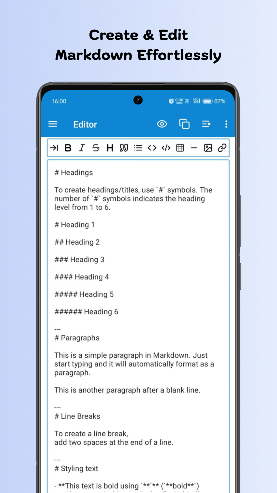
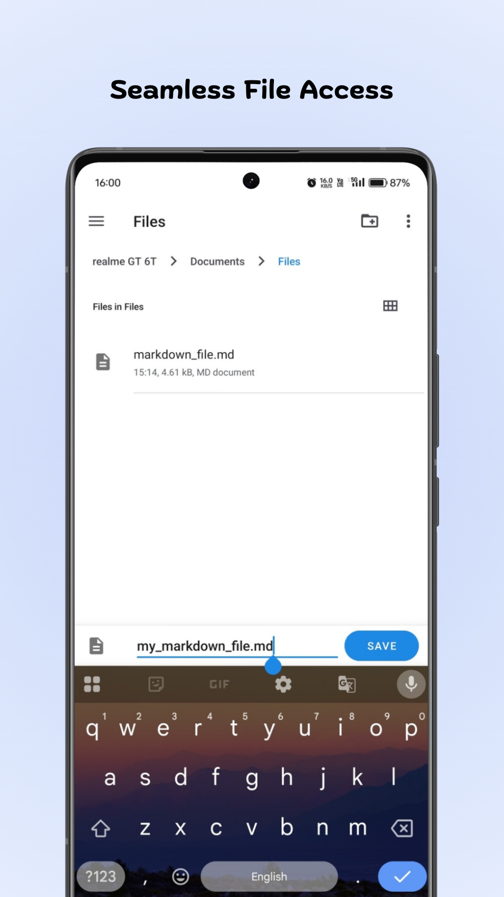
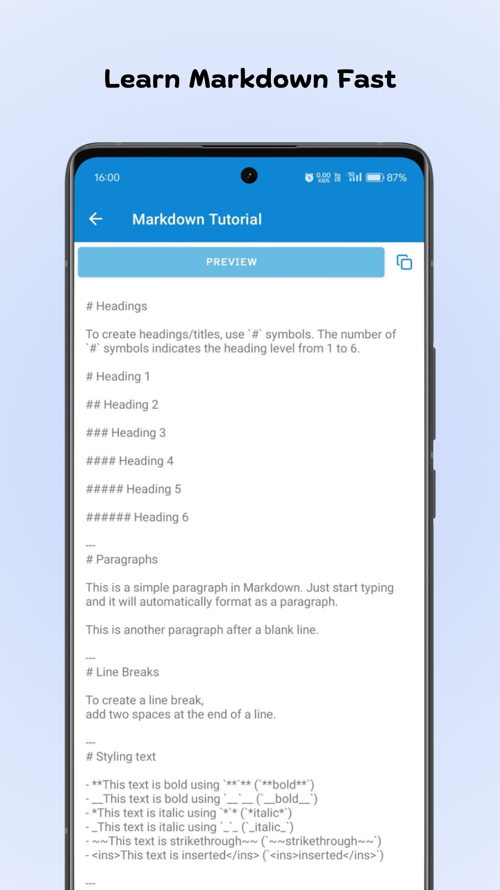
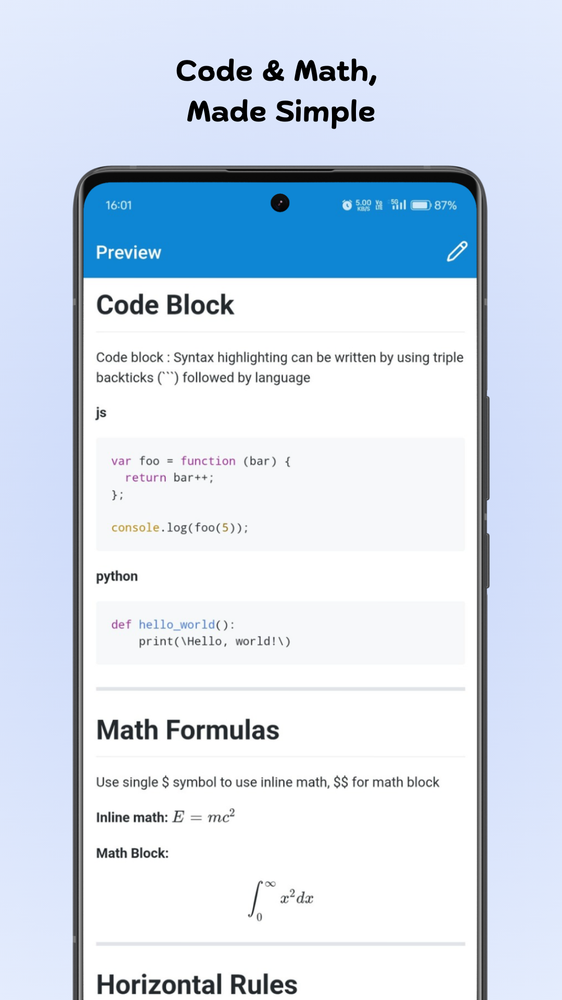
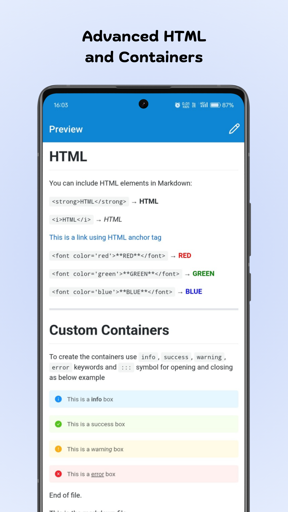
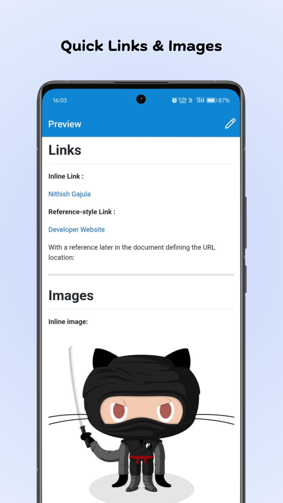
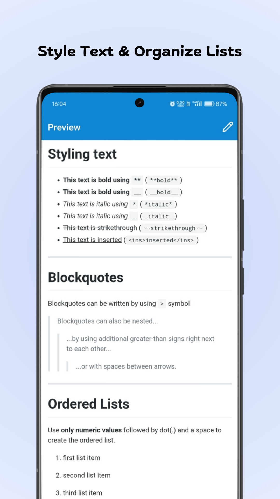
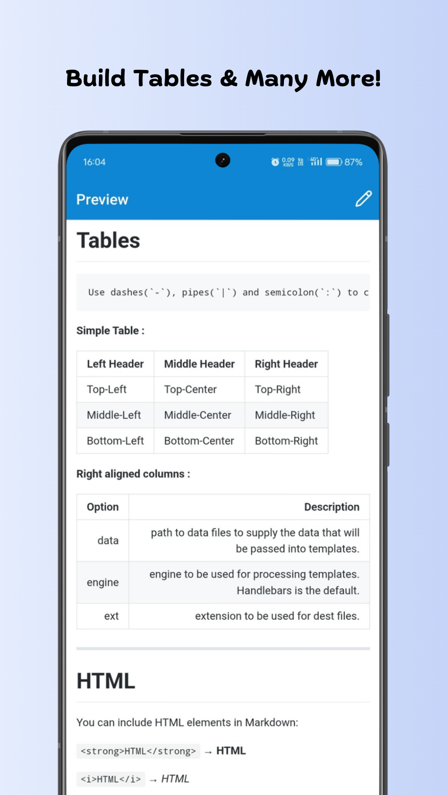

# EasyMarkdown

**Easy Markdown** is a simple and easy-to-use app for writing Markdown files on your Android device! 📝✨

✍️📂 Create new markdown files or open existing ones quickly.

👀 See your markdown text come alive with a beautiful live preview.

🔤🔗 Use handy tools to add headings, lists, bold/italic text, and links with just a tap.

➕➗Write and view math formulas with KaTeX support—great for students and anyone who loves math!

🔒📱 Keep all your files safe and private—everything is saved locally on your device.

♻️ Clear your text to start fresh anytime!

📚😊 A helpful guide is included to teach you how to use Markdown easily.

Perfect for beginners and pros alike!

Easy Markdown makes writing fun, fast, and beautiful. Try it now! 🎉

