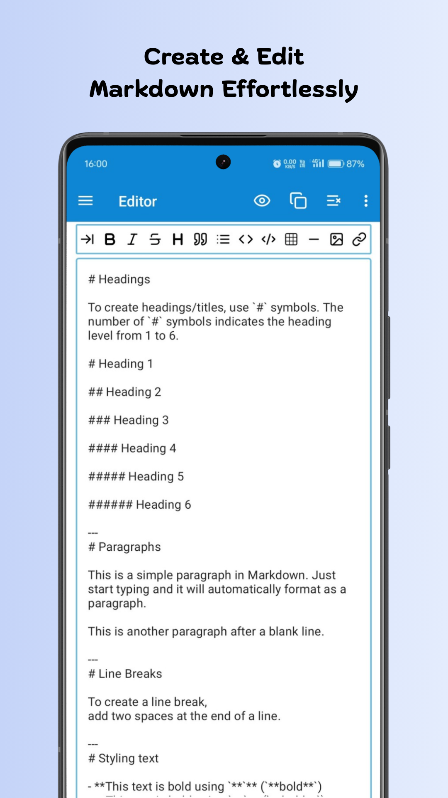
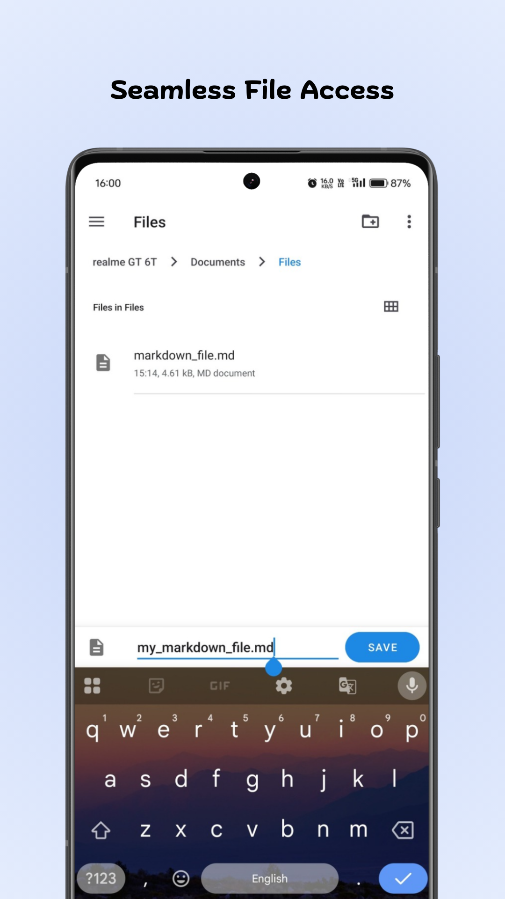
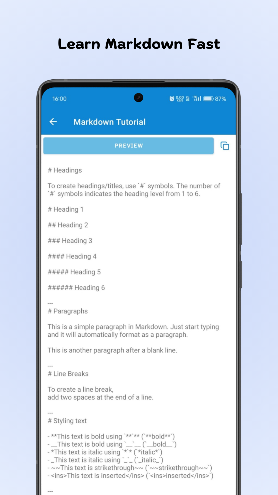
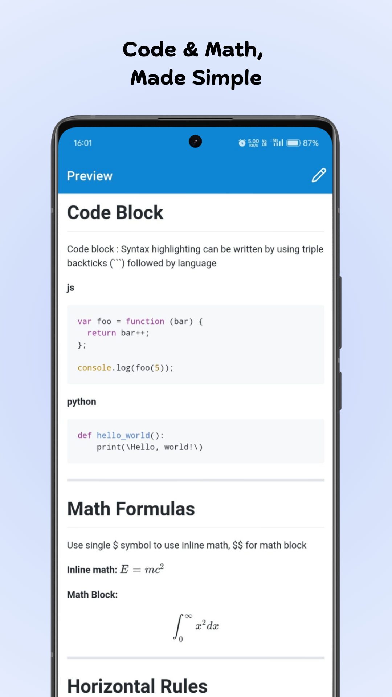
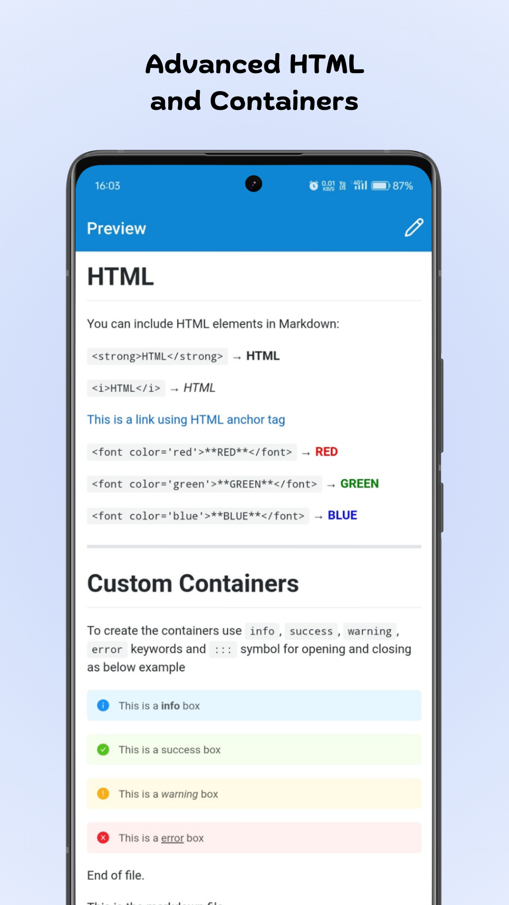
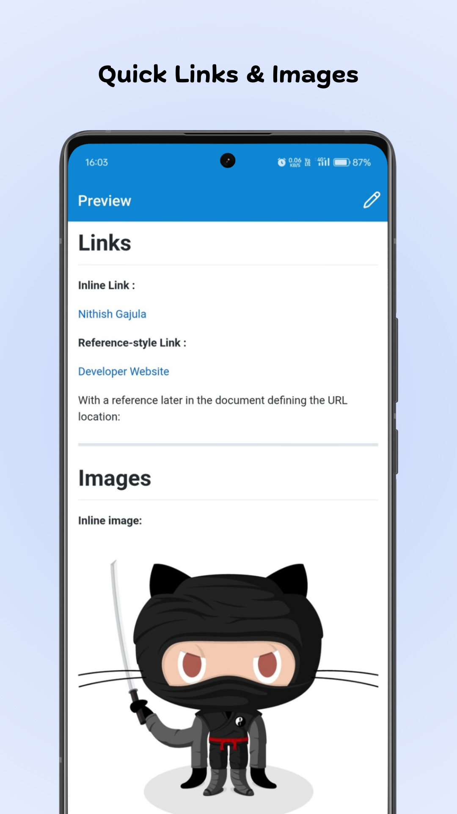
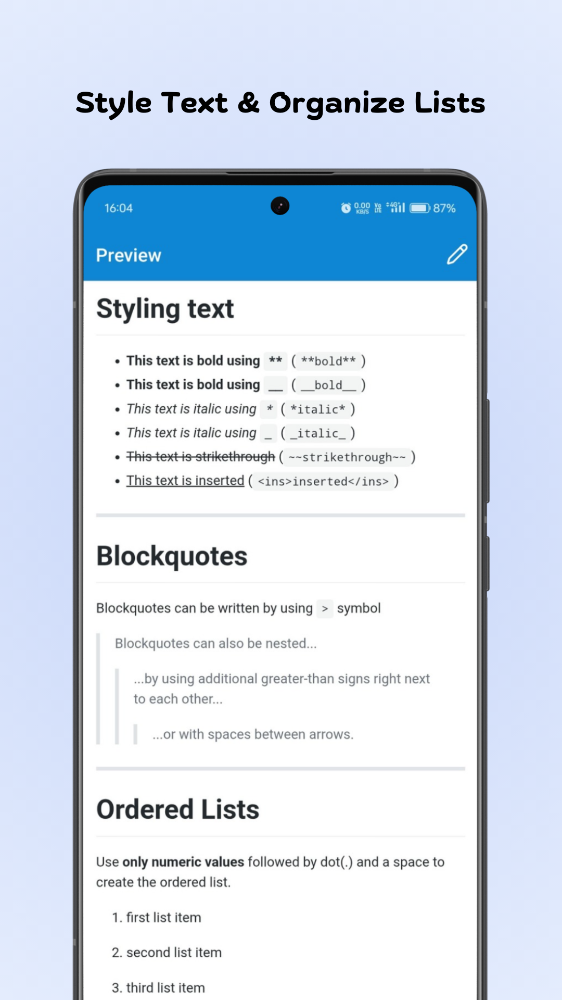
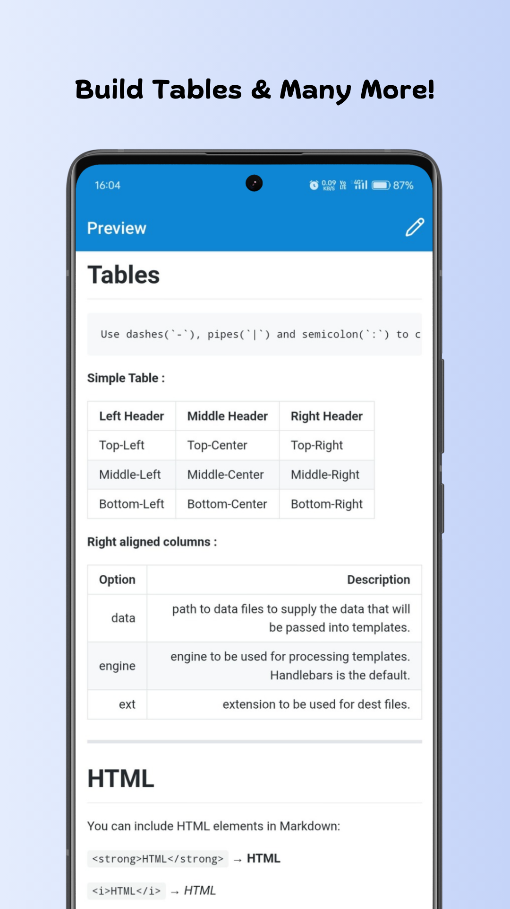

# 📜 Easy Markdown

**EasyMarkdown** is a simple, lightweight, and intuitive **Markdown editor for Android**.  
Write, edit, and preview Markdown files seamlessly — all directly on your device.

Perfect for **students, developers, writers, and Markdown enthusiasts**.

## 📸 Screenshots

  
  
  
  

  
  
  
  

## ✨ Features

- ✍️ Quickly create new `.md` files or open existing ones.
- 👀 See your Markdown rendered beautifully as you click on Preview.
- 🔤 Add headings, lists, bold/italic text, links, and more with one tap.
- ➕➗ Write and preview math equations effortlessly — ideal for students and anyone who loves math!
- 🔒 All files are stored locally on your device. No cloud, no tracking.
- ♻️ Clear your text to start fresh anytime!
- 📚 Learn Markdown syntax easily with an included beginner-friendly guide.

## 🎯 Why EasyMarkdown?

- 🚀 Fast and lightweight
- 🧠 Beginner-friendly, yet powerful
- 📱 Designed specifically for Android
- 🔐 Privacy-first approach
- 🎨 Clean and distraction-free UI

## 📝 License & Usage

Copyright © 2026 **Nithish Gajula**. All rights reserved.

This software and its source code are **proprietary** and **confidential**.  
Unauthorized copying, modification, or distribution is strictly prohibited.
Reverse engineering, decompiling, or disassembling the software is prohibited to the maximum extent permitted by law.

## 🤝 Support & Connect

  

Built with ❤️ by [Nithish Gajula](https://github.com/nithish-gajula)

**If you find this project useful, consider giving it a ⭐ on GitHub!**

